---

# Operator Task

## **1. Install NGINX Bitnami Helm Chart**

We’ll install NGINX from Bitnami with the built-in **metrics exporter** enabled.

```bash
# Add Bitnami repo
helm repo add bitnami https://charts.bitnami.com/bitnami
helm repo update
```

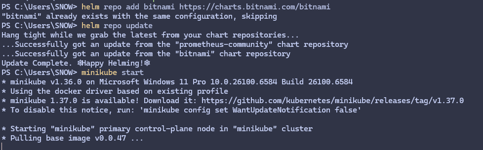

```bash
# Install nginx with metrics enabled
helm install my-nginx bitnami/nginx `
  --namespace default `
  --set metrics.enabled=true `
  --set metrics.serviceMonitor.enabled=true
```

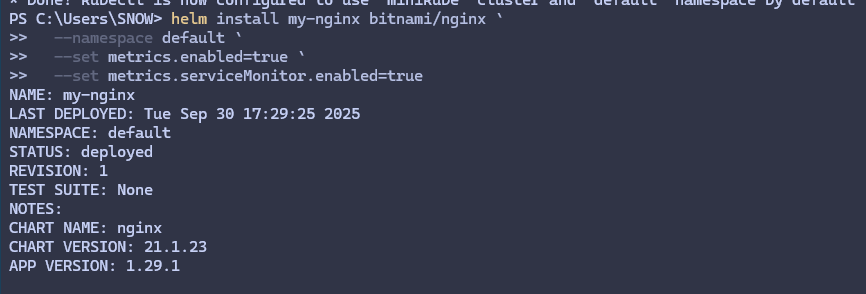
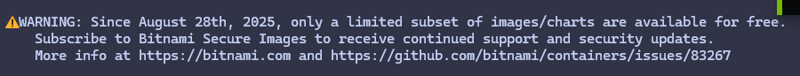

```bash
my-nginx-bffb6857f-4q8c7   0/2   Init:ImagePullBackOff
```

So Bitnami has restricted public access to some images. That’s why the pod can’t start.

So I will Use the another NGINX Helm chart
with this `values.yaml`

```yaml
controller:
  image:
    repository: registry.k8s.io/ingress-nginx/controller
    tag: "v1.11.3"
  metrics:
    enabled: true
    serviceMonitor:
      enabled: true
      additionalLabels:
        release: monitoring
```

```bash
helm repo add ingress-nginx https://kubernetes.github.io/ingress-nginx
helm repo update
helm install my-nginx ingress-nginx/ingress-nginx -f values.yaml -n ingress-nginx --create-namespace
```

and now its working
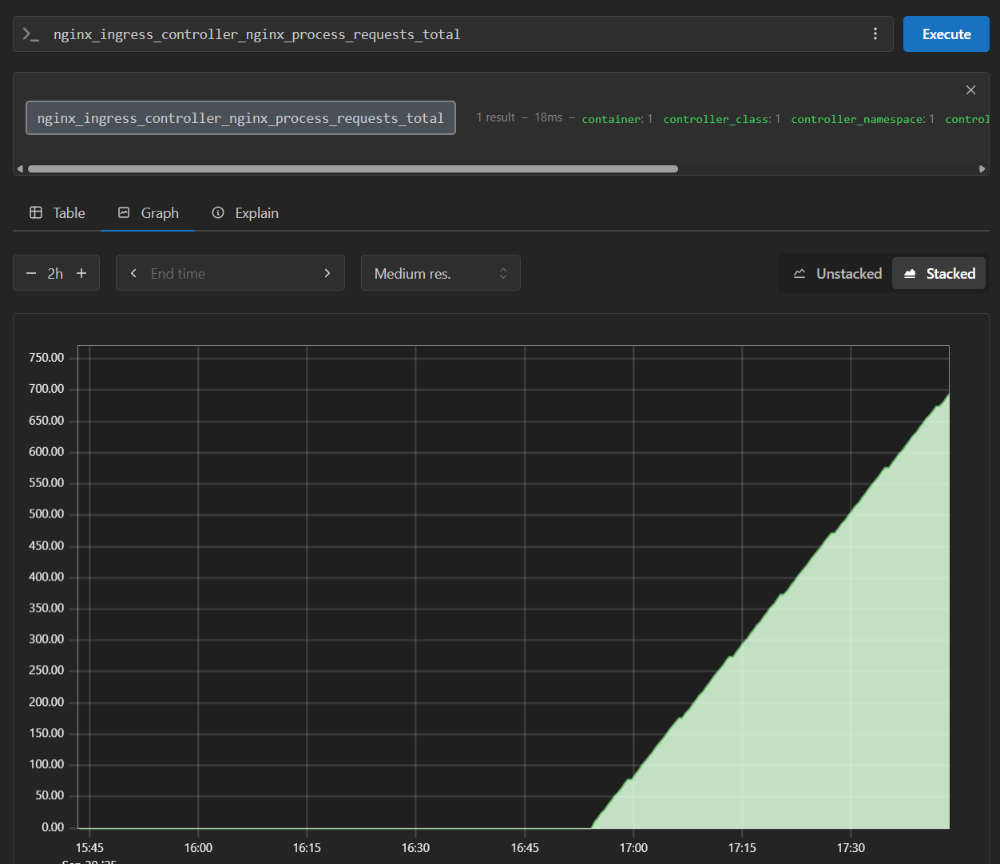
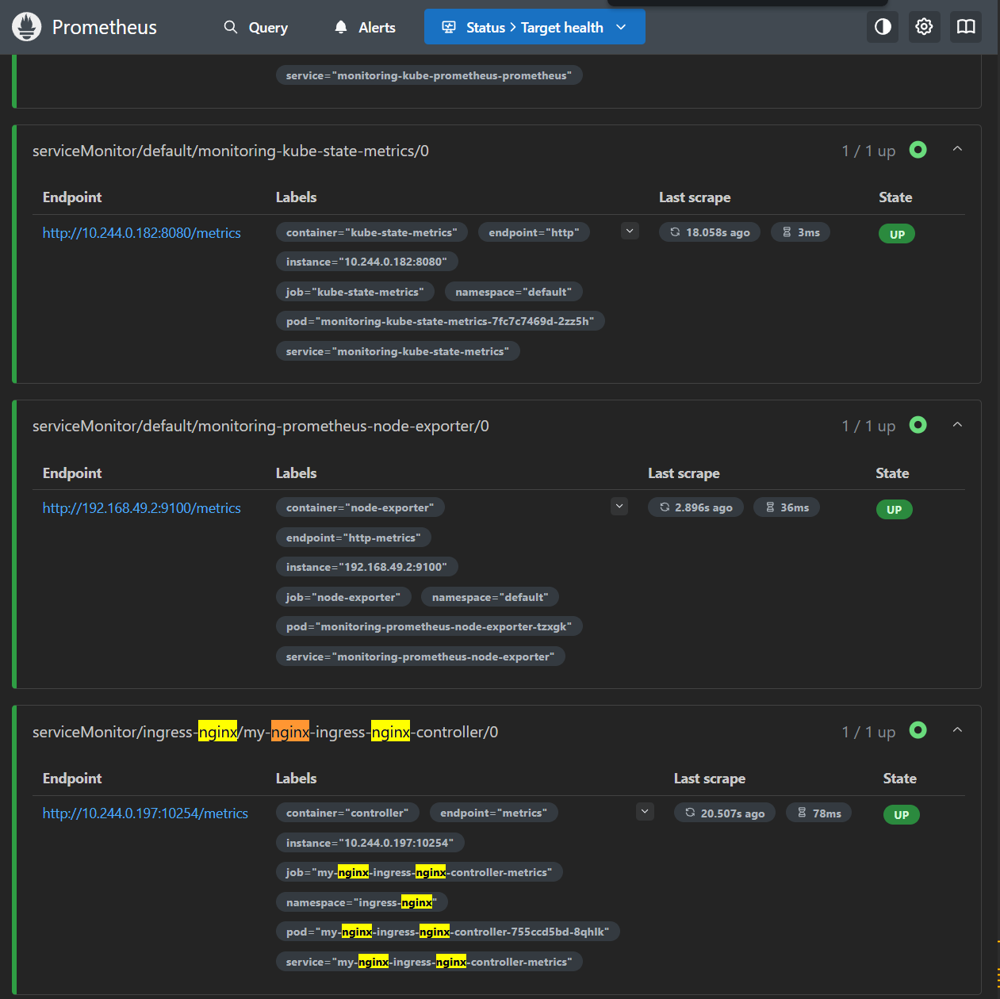
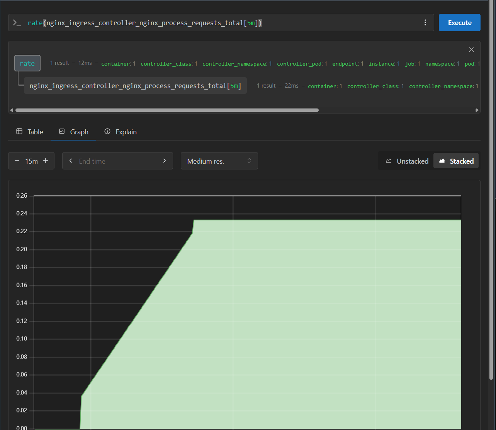

---

## **2. Create Grafana Dashboard**

Now that Prometheus is scraping NGINX, we’ll visualize it in Grafana.

**I willImport a community dashboard**
**12708 (NGINX Ingress + Exporter)** or **9614 (NGINX basic exporter)**.

I will use `12708` and this is it after importing
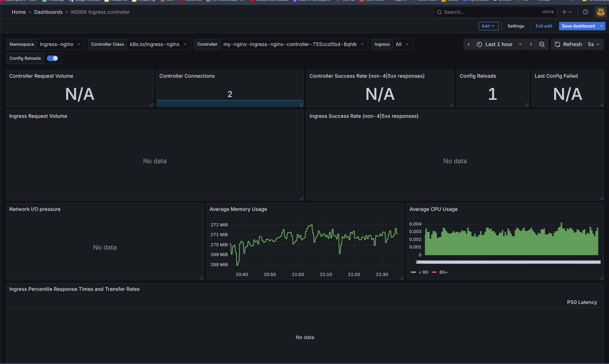
now we see connections, memory, CPU, config reloads working, but request volume, success rate, and latency are still N/A / No data.

---

## **3. Faking Data :D**

We need to **generate some traffic** through the ingress:

### 1. Create a simple demo app + service

Save this as `demo-app.yaml`:

```yaml
apiVersion: apps/v1
kind: Deployment
metadata:
  name: demo
  namespace: default
spec:
  replicas: 1
  selector:
    matchLabels:
      app: demo
  template:
    metadata:
      labels:
        app: demo
    spec:
      containers:
      - name: demo
        image: nginx:latest
        ports:
        - containerPort: 80
---
apiVersion: v1
kind: Service
metadata:
  name: demo
  namespace: default
spec:
  selector:
    app: demo
  ports:
  - port: 80
    targetPort: 80
    protocol: TCP

```

Apply it:

```powershell
kubectl apply -f demo-app.yaml
```

---

### 2. Create the Ingress

Save your Ingress YAML as `demo-ingress.yaml`:

```yaml
apiVersion: networking.k8s.io/v1
kind: Ingress
metadata:
  name: demo-ingress
  namespace: default
  annotations:
    kubernetes.io/ingress.class: "nginx"
spec:
  rules:
  - host: demo.local
    http:
      paths:
      - path: /
        pathType: Prefix
        backend:
          service:
            name: demo
            port:
              number: 80
```

Apply it:

```powershell
kubectl apply -f demo-ingress.yaml
```

---

### 3. Add local DNS entry

Edit your hosts file:

* On Windows: `C:\Windows\System32\drivers\etc\hosts`
* Add a line:

  ```bash
  127.0.0.1   demo.local
  ```

---

### 4. Access via ingress

If your ingress controller is `LoadBalancer` and external IP is `<pending>`, you can port-forward instead:

```powershell
kubectl port-forward -n ingress-nginx svc/my-nginx-ingress-nginx-controller 8080:80
```

Now open:

```bash
http://demo.local:8080/
# 
or
http://localhost:8080/
```

or run a test :

```powershell
Invoke-WebRequest -Uri "http://localhost:8080/" -Headers @{"Host"="demo.local"}
```

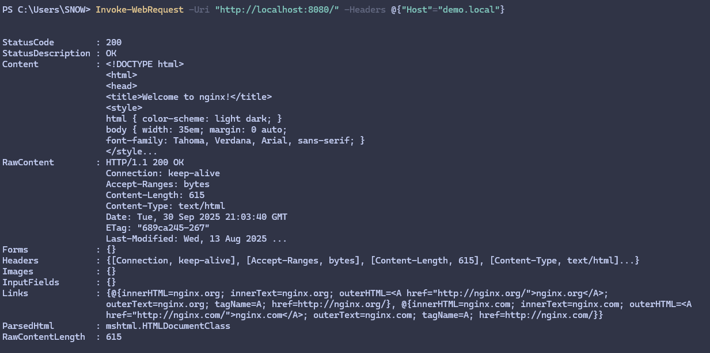

---

### 5. Generate some traffic

To make Grafana dashboards show request volume, success rate, and latency:

```powershell
for ($i=0; $i -lt 100; $i++) { Invoke-WebRequest -Uri "http://localhost:8080/" -Headers @{"Host"="demo.local"} }
```

now we get this in the dashboard :D
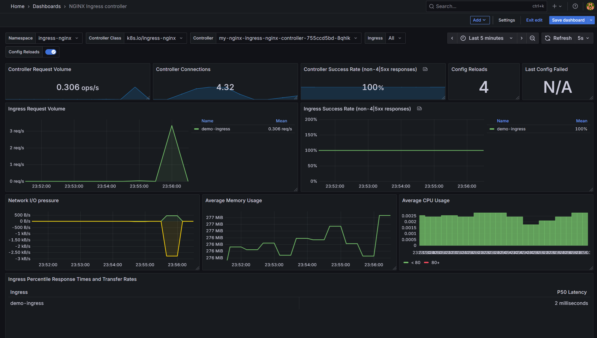
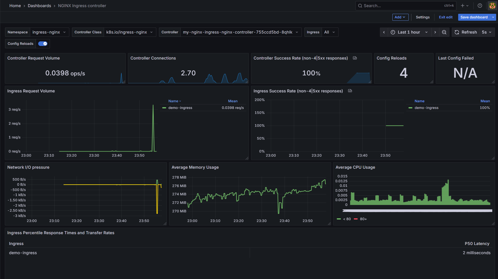
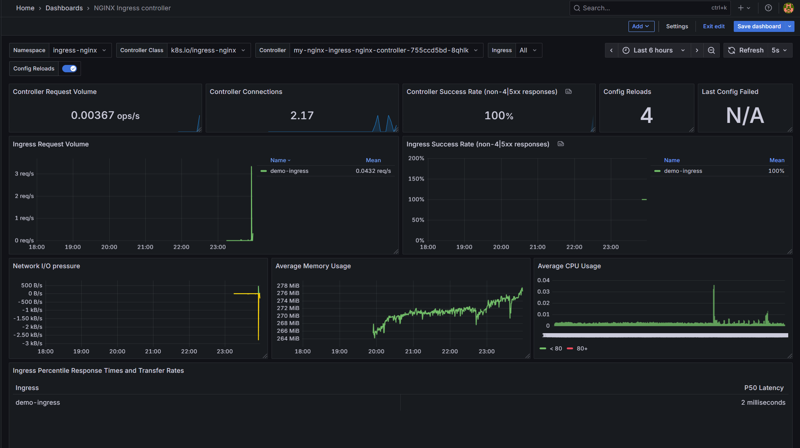

## GG

---
